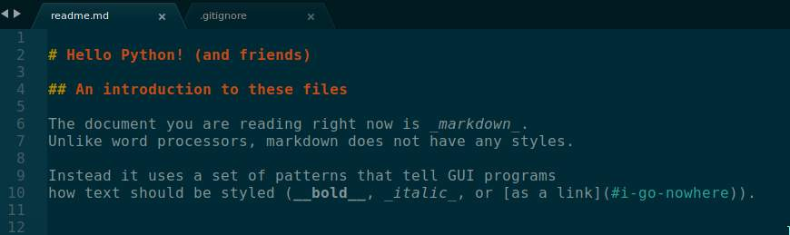
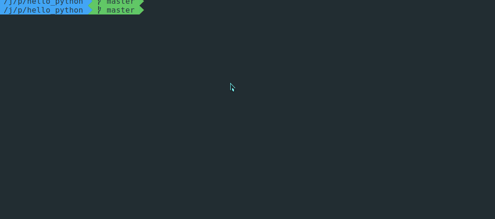

# Hello Python! (and friends)

## An introduction to these files

The document you are reading right now is _markdown_.
Unlike word processors, markdown does not have any styles.

Instead it uses a set of patterns that tell GUI programs
how text should be styled (__bold__, _italic_, or [as a link](#i-go-nowhere)).



The screenshot above shows you what is typed to make the words render differently.
The underscores (`_`) and braces (`[` and `]`) have meaning when processing a markdown file.

This is universal in the world of programming; code is written as plain text, and
transformed using tools. The final output of these tools may be a web browser,
or a videogame, or a tool to calculate how much money your school has saved from
not running buses in the fall of 2020.

## An introduction to Python

Just as markdown is a set of characters which have meaning to transform word styles,
python is a language with syntax and grammer that gives the person
writing python the ability to control what a computer does.

Don't believe me?



# Hello 01

The file `hello_01.py` contains the source of an application.
This is a very simple application, and to run it you tell the
program `python` (or `python.exe` on windows) where the file
containing the source is.

```bash
python hello_01.py
```

# Hello logic 01

The file `hello_logic_01.py` asks the user for their favorite
food and says different things based on what the user said.

```bash
python hello_logic_01.py
```


